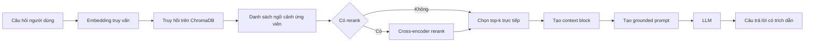

# Kiến trúc Hệ Thống RAG

## 1. Tổng quan

Hệ thống được xây dựng để trả lời câu hỏi nghiệp vụ nội bộ cho các nhóm Chăm sóc khách hàng và Hỗ trợ công nghệ thông tin. Mô hình vận hành theo kiến trúc RAG: tài liệu được chuẩn hóa và lập chỉ mục trước, sau đó hệ thống truy hồi ngữ cảnh liên quan theo truy vấn, cuối cùng sinh câu trả lời bám sát ngữ cảnh có dẫn nguồn.

Luồng dữ liệu tổng quát:

```text
Tài liệu thô
  -> Tiền xử lý và chia đoạn
  -> Sinh embedding và lưu chỉ mục vào ChromaDB
  -> Truy hồi ngữ cảnh theo câu hỏi
  -> Tùy chọn xếp hạng lại ngữ cảnh
  -> Tạo prompt có ràng buộc grounding
  -> Sinh câu trả lời kèm nguồn trích dẫn
```

## 2. Pipeline lập chỉ mục

Nguồn dữ liệu gồm năm tài liệu chính sách và quy trình trong thư mục dữ liệu nội bộ. Mỗi tài liệu được:

1. Tiền xử lý để trích xuất metadata.
2. Chia đoạn theo tiêu đề và đoạn văn.
3. Sinh embedding cho từng đoạn.
4. Lưu vào ChromaDB để phục vụ truy hồi.

Thông số lập chỉ mục:

| Thành phần | Cấu hình |
|---|---|
| Kích thước đoạn | 400 token (xấp xỉ) |
| Độ chồng lấp | 80 token (xấp xỉ) |
| Chiến lược chia đoạn | Theo tiêu đề kết hợp theo đoạn văn |
| Metadata chính | source, section, effective_date, department, access |
| Kho vector | ChromaDB (PersistentClient) |
| Độ đo tương đồng | Cosine |
| Embedding model | all-MiniLM-L6-v2 |

## 3. Pipeline truy hồi

### Cấu hình baseline

| Thành phần | Cấu hình |
|---|---|
| Chế độ truy hồi | Dense retrieval |
| Top-k search | 10 |
| Top-k select | 3 |
| Rerank | Không dùng |

### Cấu hình variant

| Thành phần | Cấu hình |
|---|---|
| Chế độ truy hồi | Hybrid (dense + BM25, hợp nhất bằng RRF) |
| Top-k search | 10 |
| Top-k select | 3 |
| Rerank | Cross-encoder |
| Query transform | Không dùng |

Mục tiêu của variant là kiểm tra khả năng tăng chất lượng truy hồi ở các câu hỏi có từ khóa kỹ thuật hoặc yêu cầu ngữ cảnh đa đoạn.

## 4. Pipeline sinh câu trả lời

Hệ thống sử dụng prompt có ràng buộc:

1. Chỉ trả lời từ ngữ cảnh đã truy hồi.
2. Không đủ dữ liệu thì từ chối trả lời thay vì suy diễn.
3. Ưu tiên câu trả lời ngắn gọn, rõ ràng.
4. Có trích dẫn nguồn theo thứ tự đoạn ngữ cảnh.

Cấu hình sinh câu trả lời:

| Tham số | Giá trị |
|---|---|
| Mô hình | gpt-4o-mini |
| Temperature | 0 |
| Max tokens | 512 |

## 5. Kiểm soát lỗi vận hành

Các điểm cần kiểm tra khi chất lượng giảm:

1. Lập chỉ mục: dữ liệu hoặc metadata thiếu/không đồng nhất.
2. Chia đoạn: đoạn bị cắt mất ý hoặc trùng lặp ngữ cảnh quá nhiều.
3. Truy hồi: không đưa được nguồn kỳ vọng vào top-k.
4. Sinh câu trả lời: câu trả lời không bám ngữ cảnh hoặc thiếu thành phần quan trọng.
5. Độ dài ngữ cảnh: quá dài dẫn đến giảm tập trung thông tin.

## 6. Sơ đồ kiến trúc


